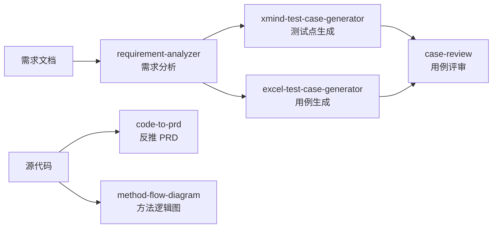
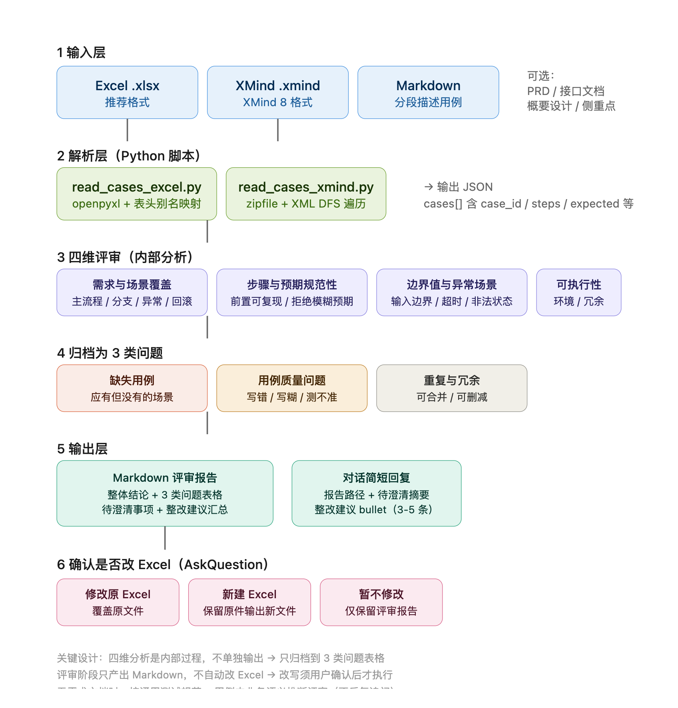

# AI Agent Skills · 测试工程能力包（陆续更新ing）

> A collection of Agent Skills for software testing — covering the full chain from requirement analysis to test case generation and review.
>
> 面向软件测试场景的 Agent Skill 集合：把「需求分析 → 测试点设计 → 用例生成 → 用例评审」这条主链路，以及「读代码反推需求 / 画方法逻辑图」这两个辅助能力，沉淀成可复用的 AI 工作流。

## 为什么做这套东西

测试工作里有大量**结构化的、重复的、有明确对错**的判断：需求里的可测项要一条条扒出来、用例要按正向/负向/边界分类、评审时要找漏场景和模糊描述。这些环节规则清晰、结果可验证，非常适合交给 LLM + 脚本去做。

这套 skill 遵循三条设计原则：

| 原则 | 说明 |
|---|---|
| **脚本负责确定性** | Excel / XMind / 文件的读写与格式校验交给 Python，不靠模型「想象」文件长什么样 |
| **Prompt 负责判断力** | 场景拆解、风险识别、问题分级交给 LLM |
| **输出可落地** | 产出的是能直接用的 Excel 用例、XMind 脑图、评审报告，不是一段聊天记录 |

<!-- 待补：建议在这里加一句你的实际效果数据，例如
     「用例评审耗时从 4h 降至 20min」/「测试点覆盖率提升 XX%」——有数字最有说服力 -->

## 能力链路



## Skills 一览

| Skill | 做什么 | 输入 → 输出 |
|---|---|---|
| [`case-review`](skills/case-review/) | 独立测试用例评审，四维内部分析 | Excel / XMind / Markdown 用例 → Markdown 评审报告 |
| [`requirement-analyzer`](skills/requirement-analyzer/) | 测试需求分析两阶段工作流 | 需求描述 / PRD → 可测项清单 + 测试点 + XMind |
| [`xmind-test-case-generator`](skills/xmind-test-case-generator/) | 从需求文档生成测试点脑图 | 需求文档 → XMind 思维导图 |
| [`excel-test-case-generator`](skills/excel-test-case-generator/) | 从需求文档生成标准用例表 | 需求文档 → Excel 测试用例 |
| [`code-to-prd`](skills/code-to-prd/) | 从源代码反向整理业务需求文档 | 代码仓库 → PRD + Mermaid 图 |
| [`method-flow-diagram`](skills/method-flow-diagram/) | 把方法/接口逻辑画成测试人员能看懂的图 | 方法名 / 接口 → 流程图 / 时序图 |

---

## 各 skill 详解

### case-review — 独立测试用例评审

**解决的问题**：用例写完没人review，漏场景、步骤模糊、重复用例混在一起，等到执行阶段才发现。

**怎么做的**：不依赖任何配置文件和项目结构，把用例文件丢给它就能评审。从四个维度做内部分析，输出三类问题分类表格 + 待澄清事项 + 整改建议汇总。涉及补用例或改写的，会在整改建议里写清前置条件、步骤、预期结果。

**技术要点**：
- `read_cases_excel.py` / `read_cases_xmind.py` — 用 openpyxl 解析 Excel 用例，用 `zipfile` + `xml.etree` 直接解析 XMind 的压缩包结构（XMind 文件本质是个 zip）
- 需求文档可选：没给 PRD 时，按通用测试规范 + 用例自身的业务语义评审



---

### requirement-analyzer — 测试需求分析

**解决的问题**：拿到需求后，怎么快速判断"这个需求要测什么、哪里风险高、还有什么没问清楚"。

**怎么做的**：分两阶段，对应两个不同的工作场景：

| 阶段 | 使用时机 | 输出 |
|---|---|---|
| 阶段一 | 需求评审会前 | 被测对象与范围概要、结构化可测项清单（P0/P1/P2 分级）、风险识别、待澄清问题列表 |
| 阶段二 | 可测项清单已澄清，进入测试执行期 | 补充边界 / 异常 / 兜底 / 竞态 / 生命周期等易漏测试点，导出 `.xmind` 文件 |

**技术要点**：`gen_xmind.py` 手写 XMind 格式（zip + XML），不依赖第三方 XMind 库；`gen_testcase_excel.py` 负责用例表导出。

---

### xmind-test-case-generator — 需求转测试点脑图

**解决的问题**：需求评审阶段需要快速产出结构化的测试点，用脑图呈现最直观。

**怎么做的**：自动识别需求文档的层级结构，生成包含**正向用例、负向用例、边界值用例、异常用例**四个分支的 XMind 文件。

**技术要点**：`xmind_generator.py` 用 `xml.etree.ElementTree` 构建 XMind 的 content.xml，用 `uuid` 生成节点 ID，最后打包成标准 `.xmind` 文件——整个流程零第三方依赖。

---

### excel-test-case-generator — 需求转 Excel 用例

**解决的问题**：需要交付格式统一、字段完整的用例表。

**怎么做的**：根据需求描述或功能规格，生成包含**用例编号、用例名称、前置条件、测试步骤、预期结果、优先级**等标准字段的 Excel 文件。

**技术要点**：`test_case_generator.py` 负责用例设计逻辑（正向 / 负向 / 边界值的拆解规则），`generate_testcases.py` 用 openpyxl 负责样式渲染与落盘。`references/` 下沉淀了两份设计规范：需求分析方法论、用例设计方法论。

---

### code-to-prd — 代码反推需求文档

**解决的问题**：接手一个没有文档的老模块，或者需要验证"代码实现和产品文档是否一致"。

**怎么做的**：扫描代码仓库，先输出模块清单让你选，再针对选定的模块反向整理出业务需求文档，包含 Mermaid 流程图、时序图和字段表格。

**技术要点**：`references/module-discovery.md` 定义了模块发现的策略，`references/prd-writing-rules.md` 约束了 PRD 的写作规范，`templates/prd-template.md` 保证输出格式统一——重点是**先发现再分析**，避免一上来就全仓库扫描。

---

### method-flow-diagram — 方法逻辑图

**解决的问题**：测试同学看代码时，最需要的是"这个方法在业务上到底做了什么、用户会看到什么"，而不是代码本身。

**怎么做的**：只读代码、不改代码。根据指定的方法或接口，画出一张逻辑图。读者是测试人员，所以图上用**场景语言**描述系统行为。已安装 draw.io 则导出 `.drawio` 和 PNG，否则输出 Mermaid。

**技术要点**：`scripts/check-drawio.sh` 自动探测本地环境并选择输出格式，`references/diagram-choice.md` 定义了流程图与时序图的选择规则。

---

## 环境要求

- **Python** 3.8+
- **openpyxl** — 唯一需要的第三方库，用于 Excel 读写
  ```bash
  pip install openpyxl
  ```
- 其余功能（XMind 生成、XML 解析）均基于 Python 标准库实现，无需额外安装
- 建议在支持 Skill 机制的 Agent 环境中使用（如 Claude Code、Cursor 等）

## 使用方式

每个 skill 目录下的 `SKILL.md` 是完整的说明文档，包含触发条件、输入输出规范和核心逻辑。把 `skills/` 下的目录复制到你的 skill 加载路径即可。

## 新增 skill 的发布前检查

仓库自带一个脱敏扫描脚本。新增 skill、提交之前先跑一遍：

```bash
./scripts/check-before-publish.sh skills/<新 skill 目录>
```

脚本会检查 8 类风险：

| 类别 | 检查内容 |
|---|---|
| 凭证 | API Key / Token / 密码的硬编码 |
| 内网 IP | 私有 IP 段（`10.x` / `192.168.x` / `172.16-31.x`） |
| 内网域名 | `gitlab.` / `intra.` / `corp.` 等内部域名前缀 |
| 本机信息 | 本地绝对路径（`/Users/` 等） |
| 版本管理 | 嵌套 `.git`（会被 git 识别成 submodule） |
| 文件卫生 | `.DS_Store` / `__pycache__` / `*.pyc` |
| 体积 | 超过 5MB 的大文件 |
| 来源 | 市场导入残留的 `_meta.json` 等元数据 |

> 自动扫描覆盖不了业务专有名词、真实人名和公司产品名——这些必须人工再确认一遍。

## 关于我

10年+软件测试经验，传统测试结合AI 测试转型中。这套 skill 是转型过程中的实践沉淀，会陆续更新ing

- [llm-testcase-service](https://github.com/mumu1030/llm-testcase-service) — 基于 FastAPI +AI测试用例生成服务

## License

[MIT](LICENSE)
