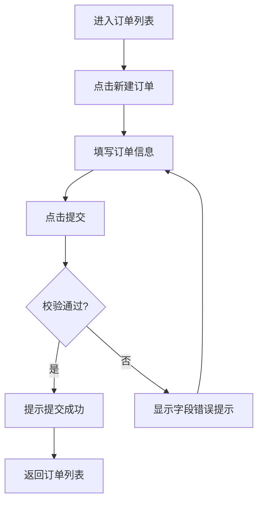
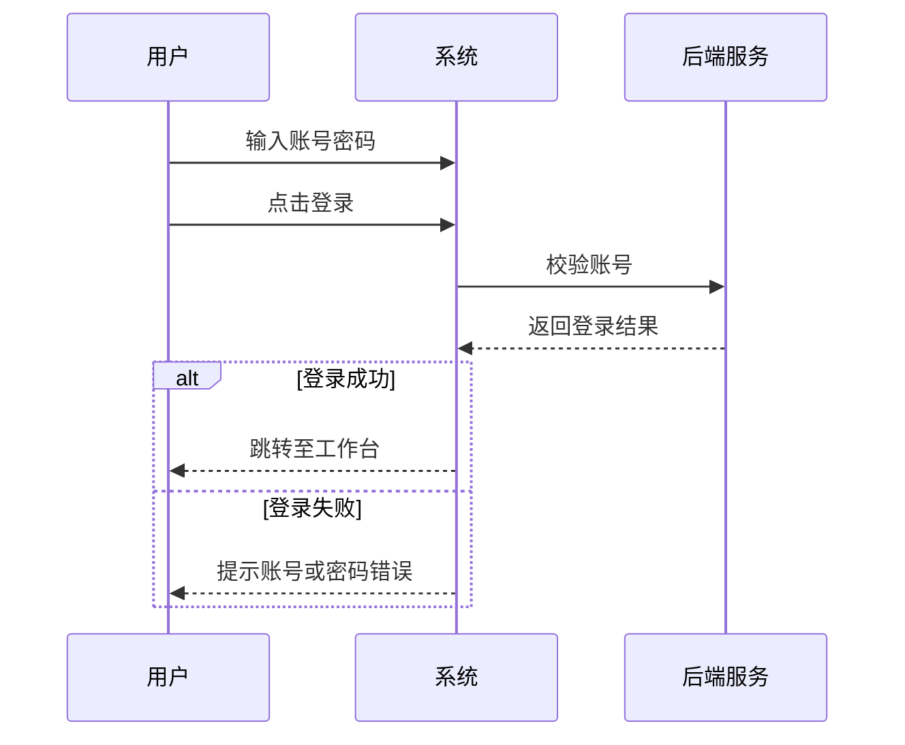
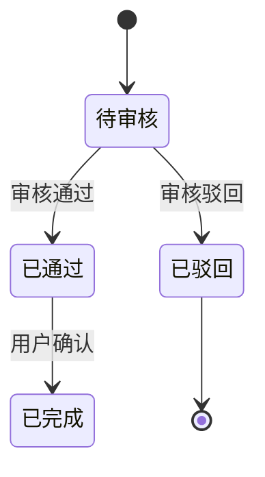

# PRD 写作规范

面向产品、业务、测试人员。从代码反推需求，保持业务语言，避免技术细节。

## 核心原则

1. **业务视角**：描述「用户能做什么」「系统如何响应」，不写实现方式
2. **有据可依**：每条需求对应代码中的可见行为；不确定的写入开放问题
3. **禁止编造**：不臆测未在代码中出现的业务规则

## 禁止出现在正文

| 禁止 | 替代写法 |
|------|----------|
| 类名、函数名 | 删除或改为业务动作 |
| API 路径（如 `/api/v1/users`） | 「提交用户信息」 |
| 数据库表名、字段英文名 | 使用字段中文名 |
| 框架术语（Vuex、Redux、Hook） | 删除 |
| 路由路径（如 `/login`） | 【登录页】 |
| 枚举原始值（如 `status=0`） | 状态为「在住」 |
| HTTP 状态码 | 登录失败、权限不足 |

**允许**：在「文档信息 → 来源代码路径」中列出路径，供开发追溯。

## 页面与功能引用

- 页面：【登录页】【订单列表页】
- 按钮：点击「提交」「取消」
- 提示：显示「请输入手机号」
- 跳转：跳转至【工作台】

## 字段表格规范

| 列 | 说明 |
|----|------|
| 字段名 | 中文，来自 Form label / 列 title |
| 类型/格式 | 文本、数字、日期、下拉、附件等 |
| 必填 | 是/否/条件必填 |
| 说明 | 业务含义、占位提示 |
| 校验/业务规则 | 长度、格式、枚举可选值 |

枚举值用「」包裹：`可选值：「待审核」「已通过」「已驳回」`

## 功能 ID 规范

- 格式：`REQ-001`、`REQ-002` 递增
- 验收标准：`AC-1`、`AC-2`（同一 REQ 下多条）
- 优先级：P0（核心）、P1（重要）、P2（次要）

## Mermaid 规范

### 通用

- 节点 ID 用 camelCase 或 snake_case，**不用空格**
- 节点标签用中文：`loginPage[登录页]`
- 特殊字符用双引号：`A["提交(确认)"]`
- 每个模块至少 1 个 flowchart + 1 个 sequenceDiagram

### flowchart（业务流程）

用于主流程、分支、审批流。



规则：
- 菱形表示判断
- 矩形表示动作
- 箭头标注条件（是/否、成功/失败）

### sequenceDiagram（交互时序）

用于用户 ↔ 系统 ↔ 外部服务的交互。



规则：
- participant 用中文别名
- 不用技术术语（API、接口）作 participant 名，用「后端服务」「支付平台」

### stateDiagram-v2（状态流转，可选）

用于订单状态、审批状态等。



## 页面/功能说明写法

每个页面或子功能：

```markdown
### 订单列表页

**功能说明**：展示当前用户的订单，支持筛选与分页。

**操作步骤**：
1. 进入【订单管理】模块
2. 在筛选区选择状态为「待支付」
3. 点击「查询」

**预期结果**：列表仅显示待支付订单，按创建时间倒序排列。

**异常**：
- 无数据时显示「暂无订单」
- 未登录时跳转至【登录页】
```

## 开放问题写法

```markdown
## 开放问题 / 待产品确认

- [ ] 订单取消后是否允许重新创建？代码中未发现取消后的入口限制
- [ ] 「加急」状态的审批时限？前端无相关展示
```

## 自检清单

撰写完成后检查：

- [ ] 正文无类名、函数名、API 路径
- [ ] 至少 1 个 flowchart + 1 个 sequenceDiagram
- [ ] 至少 1 个字段说明表格
- [ ] 功能清单含 REQ ID 与优先级
- [ ] 开放问题已列出无法推断项
- [ ] 来源代码路径仅在文档信息表中
