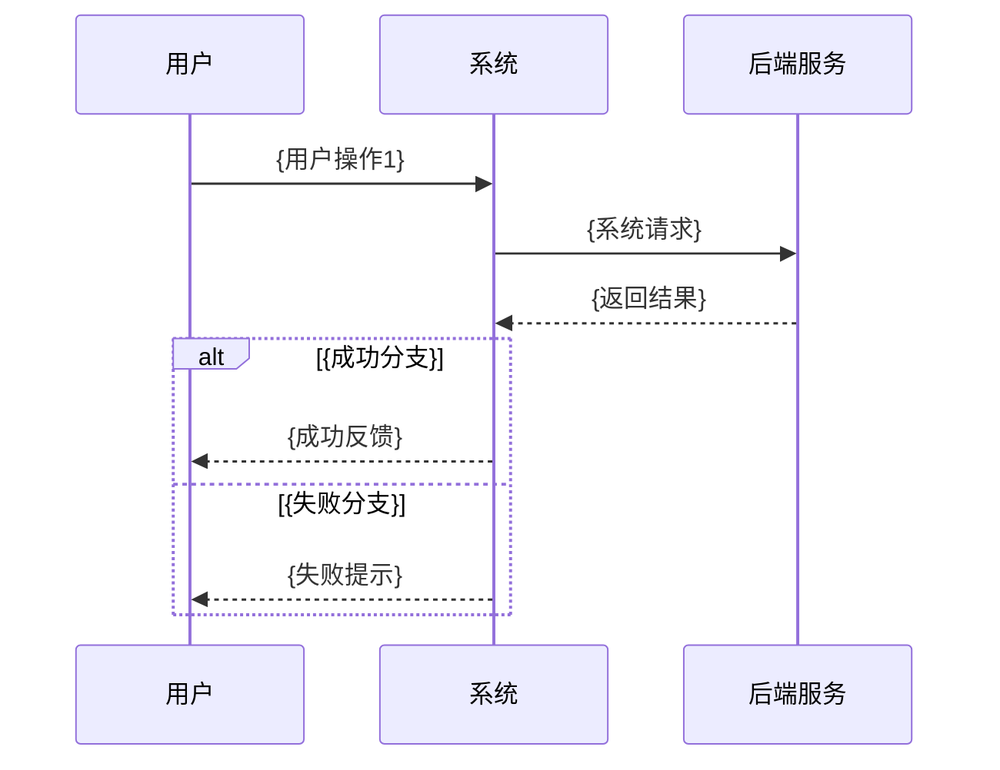

# {模块名} — 业务需求文档

> 模板说明：生成时替换 `{占位符}`，删除本 HTML 注释块。本文件为结构参考，不作为最终交付物。

## 文档信息

| 项目 | 内容 |
|------|------|
| 模块名称 | {模块名} |
| 文档版本 | v1.0 |
| 更新日期 | {YYYY-MM-DD} |
| 来源代码路径 | {如：src/views/order/、OrderController.java} |
| 说明 | 本文档由代码反向整理，供产品确认与补充 |

## 模块概述

<!-- 1–2 段：模块解决什么业务问题、面向谁、主要能力。不写技术栈。 -->

{模块名}用于{业务背景与目标用户}。用户可通过本模块完成{核心能力概述}。

## 角色与权限

| 角色 | 可执行操作 | 限制 |
|------|------------|------|
| {如：普通用户} | {如：查看自己的订单、创建订单} | {如：不可查看他人订单} |
| {如：管理员} | {如：查看全部订单、审核、导出} | {如：无} |

## 功能清单

| 功能 ID | 功能名 | 说明 | 优先级 |
|---------|--------|------|--------|
| REQ-001 | {功能名} | {简要说明} | P0 |
| REQ-002 | {功能名} | {简要说明} | P1 |

## 业务流程

<!-- 主业务流程，节点用中文业务动作 -->

```mermaid
flowchart TD
    startNode[进入{模块名}] --> step1[{步骤1}]
    step1 --> step2[{步骤2}]
    step2 --> decision{{判断条件?}}
    decision -->|是| success[{成功结果}]
    decision -->|否| fail[{失败/异常处理}]
    success --> endNode[流程结束]
    fail --> endNode
```

## 关键交互时序

<!-- 至少 1 个核心流程：用户 ↔ 系统 ↔ 外部服务 -->



## 页面/功能说明

### {页面或子功能名称}

**功能说明**：{1–2 句说明用途}

**操作步骤**：
1. {步骤1}
2. {步骤2}
3. {步骤3}

**预期结果**：{操作完成后的界面或数据变化}

**异常与边界**：
- {异常场景1}：{系统表现}
- {异常场景2}：{系统表现}

<!-- 每个主要页面/子功能重复上述结构 -->

### {第二个页面或子功能}

**功能说明**：{说明}

**操作步骤**：
1. {步骤}

**预期结果**：{结果}

## 字段说明

| 字段名 | 类型/格式 | 必填 | 说明 | 校验/业务规则 |
|--------|-----------|------|------|---------------|
| {字段中文名} | {文本/数字/日期/下拉} | {是/否} | {业务含义} | {长度、格式、可选值等} |

## 业务规则与状态

<!-- 若有状态流转，可用 stateDiagram；否则用列表 -->

### 状态说明

| 状态 | 含义 | 可执行操作 |
|------|------|------------|
| {状态名} | {说明} | {如：编辑、提交、取消} |

### 状态流转（可选）

```mermaid
stateDiagram-v2
    [*] --> {初始状态}
    {初始状态} --> {下一状态}: {触发动作}
    {下一状态} --> [*]
```

### 其他业务规则

- {规则1：如「同一用户同时只能有 N 个待支付订单」}
- {规则2}

## 异常与边界

| 场景 | 触发条件 | 系统表现 |
|------|----------|----------|
| {如：未登录访问} | {条件} | {跳转登录页/提示} |
| {如：无权限} | {条件} | {提示无权限/按钮不可见} |
| {如：空数据} | {条件} | {展示空状态文案} |
| {如：网络异常} | {条件} | {错误提示} |

## 验收标准（可选）

| REQ ID | 编号 | 给定… | 当… | 那么… |
|--------|------|-------|-----|-------|
| REQ-001 | AC-1 | {前置条件} | {用户操作} | {预期结果} |

## 开放问题 / 待产品确认

<!-- 无法从代码推断的内容，禁止编造 -->

- [ ] {问题1：如「删除后是否可恢复？代码中未发现相关逻辑」}
- [ ] {问题2}
