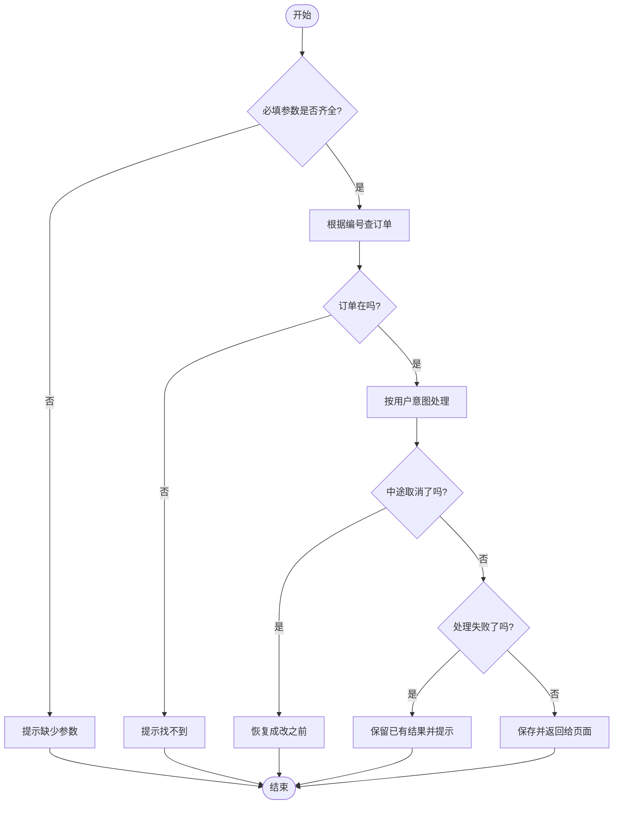
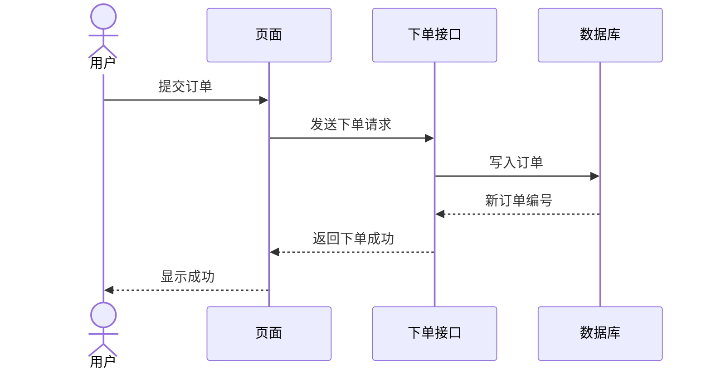

# 选图规则与 Mermaid 模板

只出一张图。用户点名「流程图」或「时序图」时服从用户。

图上文字给测试人员看：用场景语言，不要方法名、类名、接口路径。

## 判定

| 选 | 当代码主要表现为 |
|----|------------------|
| 时序图 | 多个角色按时间交互：用户、页面、本功能、存储、其它服务 |
| 流程图 | 单方法内部怎么走：分支、循环、提前结束、校验判断，基本只有这一条处理路径 |

两者都明显时：以**主路径**为准。主路径是多方配合则时序图；主路径是分支判断则流程图。不要两张都出。

接口：若重点是「谁在何时跟谁配合」，用时序图（参与者 = 用户/页面 + 本功能 + 主要依赖）。若重点是某个实现内部的分支，用流程图。

## 节点与标签

- 中文表述动作及用户可见结果，例如：`必填参数是否齐全?`、`根据编号查订单`
- **12–20** 个节点（含开始/结束或时间线上的关键消息）
- 测试能感知的分支都要画：校验失败、依赖不可用、需确认、取消/超时、成败时页面分别看到什么（按本方法实际路径取舍）
- 流程图只保留一个「结束」，各出口汇入
- 合并日志、无关读取、纯转发、内部重试
- 不要把文件路径、完整命令、方法名、类名、接口路径画进图
- 时序图参与者用业务角色（用户、页面、本功能、存储、外部服务等），按代码实际协作方命名
## Mermaid：流程图

决策边必须标 `是` / `否`。用 `flowchart TB`。

````markdown
# {symbol} 逻辑图

- 目标：`{symbol}`
- 图类型：流程图
- 生成方式：Mermaid（未检测到 draw.io）


````

节点形状约定：`([ ])` 开始/结束，`[]` 处理，`{}` 判断。

## Mermaid：时序图

参与者用角色名；消息用自然语言。同步 `->>`，异步 `-->>`，返回 `-->>` 或 `-->`。

````markdown
# {symbol} 逻辑图

- 目标：`{symbol}`
- 图类型：时序图
- 生成方式：Mermaid（未检测到 draw.io）


````

时间线宜 3–6 条。同一角色来回的琐碎读取不要拆成多条消息。
